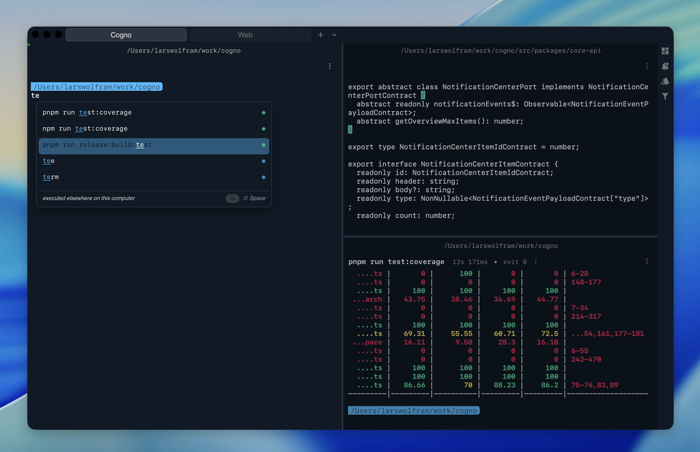

# Cogno

Cogno is a lightweight, customizable terminal designed to support your daily workflow.
It helps you spend less time searching and more time doing with fast,
context-aware autocomplete and a clean, focused experience. Cogno is
local-first, open source, and built to stay out of your way. It works on
Windows, Linux, and MacOS with PowerShell, Bash, and Zsh.

## Highlights

- Autocomplete for 1000+ CLI commands
- Multiple tabs and split panes
- Reusable workspaces for recurring setups
- Editor-like input behavior
- Command palette and terminal search
- Notifications for long-running commands and OSC 9 messages
- Windows, Linux, and macOS support
- PowerShell, Bash, and Zsh support
- Process information for active shells and commands
- CLI access for automation and scripting
- Tiny executable, typically under 50 MB

## Why Cogno?

Terminals are often where development, debugging, deployment, and daily automation meet. Cogno is built around that reality: keep the speed and flexibility of the shell, add structure where long-running work benefits from it, and make powerful commands easier to find when you need them.

The project is actively shaped as a community-friendly workspace for modern terminal use. Feedback, issue reports, ideas, and focused contributions are welcome.

See [CONTRIBUTING.md](./CONTRIBUTING.md) for setup, checks, and contribution
guidelines. Please also read the [Code of Conduct](./CODE_OF_CONDUCT.md)
before joining project spaces.

## Community

- Website: [cogno.rocks](https://cogno.rocks)
- Discord: [Join the Cogno Discord](https://discord.gg/hNk9zzzRnU)
- Reddit: [r/cogno](https://www.reddit.com/r/cogno/)
- YouTube: [Cogno on YouTube](https://www.youtube.com/channel/UCPzQB0-9aaBQj1glWJIG6xw)

## Quick Start

```bash
pnpm install
pnpm dev
```

For the desktop application, make sure the platform-specific Tauri
prerequisites are installed as well.

## License

The project source code in this repository is licensed under `MPL-2.0`,
except for `src/packages/features`, which is licensed under `MIT`, unless a
file or directory contains a different third-party license notice.

## Configuration

Cogno ships with bundled defaults and keeps user overrides small.

That keeps the user config readable while still exposing the full settings surface through:

```bash
cogno config show --defaults
```

User files live in the Cogno home directory:

- `~/.cogno`
- in development builds: `~/.cogno-dev`

There you will find:

- the user settings
- generated shell integration scripts under `shell-integration/`
- database file `cogno.db`

## CLI

```bash
cogno [--config <path>] [--set key=value ...]
  run
  action
    list
    run <name> [args...]
  config
    show [--defaults]
    get <key>
    path
```

Examples:

```bash
cogno --help
cogno config show --defaults
cogno config get shell.default
cogno action list
cogno action run open_config
```

## Development

### Prerequisites

- Node.js
- `pnpm`
- Rust toolchain
- Tauri prerequisites for your platform

### Install

```bash
pnpm install
```

### Run

```bash
pnpm dev
```

### Useful Commands

```bash
pnpm lint          # run code and architecture linting
pnpm typecheck     # run the TypeScript compiler without emitting files
pnpm test          # run the automated test suite
pnpm build         # build the web application for production
pnpm build:desktop # build the desktop application bundle
```

### Repository Layout

Main areas:

- `src/app`
  Angular entry point: configures DI and registers the product
- `src/packages/__test__`
  shared test helpers, fixtures, and mocks
- `src/packages/app`
  platform contract implementations, Angular adapters, terminal UI, and runtime wiring
- `src/packages/app-tauri`
  Tauri adapters for desktop integration; proxies AI provider HTTP requests to the backend
- `src/packages/assets`
  shared styles, icons, fonts, and static assets
- `src/packages/core-api`
  stable platform contracts: abstract classes and interfaces consumed by all layers
- `src/packages/core-domain`
  framework-independent domain logic and use cases
- `src/packages/core-support`
  small, pure, low-dependency utilities
- `src/packages/core-ui`
  generic UI building blocks with no feature or app semantics
- `src/packages/features`
  complete feature logic: AI chat, workspaces, notifications, autocomplete, shell support, and search
- `src/products`
  composition layer: binds features, app, and Angular providers for a specific product
- `src-tauri`
  native desktop wrapper and Rust-side commands
