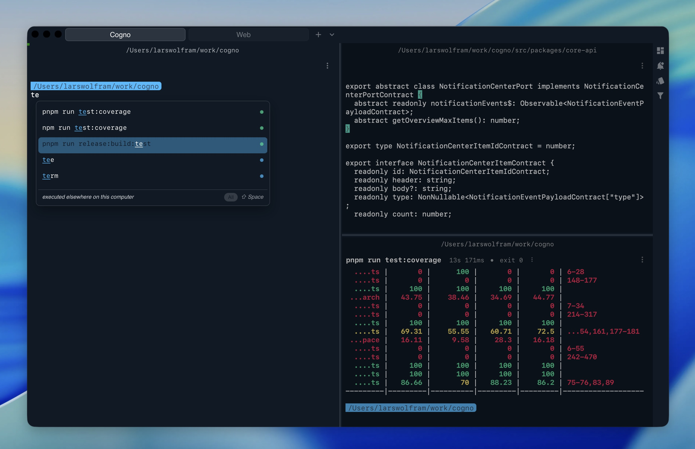

# Cogno

The terminal, without the extra work.

Cogno is a terminal for modern developers. It remembers commands,
keeps projects organized, and gives you familiar shortcuts out of the box.
Less mental load. More doing.

Cogno is local-first, open source, and built to stay close to the way you
already work. It runs on Windows, Linux, and macOS with PowerShell, Bash, and
Zsh.

## Highlights

- Context-aware command suggestions based on command history, current
  directory, and project context
- 1000+ CLI integrations, powered entirely on-device
- Editor-like input behavior with familiar shortcuts for cursor movement,
  selection, and replacement
- Live detection and status of running coding agents (Claude Code, Codex,
  Gemini, and more) shown in the tab and side panel, with notifications
- Reusable workspaces with saved tabs, panes, and project layouts
- Notifications for long-running commands, including OSC 9 support
- Search and filtering for the current command output or the full terminal
  buffer
- Fast command palette for actions
- Windows, Linux, and macOS support
- PowerShell, Bash, and Zsh support
- Process information for active shells and commands
- CLI access for automation and scripting
- Single self-contained binary, typically under 40 MB

## Why Cogno?

Terminal work is where development, debugging, deployment, and automation
happen, but the experience often comes with unnecessary repetition: hunting for
old commands, rebuilding pane layouts, scrolling through noisy output, or
losing track of what a coding agent is doing.

Cogno keeps the speed and flexibility of the shell, then adds the structure
that recurring work benefits from: command memory, workspace persistence,
editor-like input, focused search, and coding-agent awareness directly in the
terminal.

The project is actively shaped as a community-friendly terminal workspace.
Feedback, issue reports, ideas, and focused contributions are welcome.

See [CONTRIBUTING.md](./CONTRIBUTING.md) for setup, checks, and contribution
guidelines. Please also read the [Code of Conduct](./CODE_OF_CONDUCT.md)
before joining project spaces.

## Community

- Website: [cogno.rocks](https://cogno.rocks)
- Discord: [Join the Cogno Discord](https://discord.gg/hNk9zzzRnU)
- Reddit: [r/cogno](https://www.reddit.com/r/cogno/)
- YouTube: [Cogno on YouTube](https://www.youtube.com/channel/UCPzQB0-9aaBQj1glWJIG6xw)

## Quick Start

```bash
pnpm install
pnpm dev
```

For the desktop application, make sure the platform-specific Tauri
prerequisites are installed as well.

## License

The project source code in this repository is licensed under `MPL-2.0`,
except for `src/features`, which is licensed under `MIT`, unless a
file or directory contains a different third-party license notice.

## Configuration

Cogno ships with bundled defaults and keeps user overrides small.

That keeps the user config readable while still exposing the full settings surface through:

```bash
cogno config show --defaults
```

User files live in the Cogno home directory:

- `~/.cogno`
- in development builds: `~/.cogno-dev`

There you will find:

- the user settings
- generated shell integration scripts under `shell-integration/`
- database file `cogno.db`

### Shell integration over SSH

Cogno authenticates its shell-integration sequences with a per-session
secret in `COGNO_SESSION_TOKEN`. A remote host does not know it, so its
output cannot change the session's context. If you install the
integration on a host and want it to work through SSH, forward the token
explicitly: `SendEnv COGNO_SESSION_TOKEN` in your `ssh_config` (and
`AcceptEnv COGNO_SESSION_TOKEN` in the host's `sshd_config`).

## CLI

```bash
cogno [--config <path>] [--set key=value ...]
  run
  action
    list
    run <name> [args...]
  config
    show [--defaults]
    get <key>
    path
```

Examples:

```bash
cogno --help
cogno config show --defaults
cogno config get shell.default
cogno action list
cogno action run open_config
```

## Development

### Prerequisites

- Node.js
- `pnpm`
- Rust toolchain
- Tauri prerequisites for your platform

### Install

```bash
pnpm install
```

### Run

```bash
pnpm dev
```

### Useful Commands

```bash
pnpm lint          # run code and architecture linting
pnpm typecheck     # run the TypeScript compiler without emitting files
pnpm test          # run the automated test suite
pnpm build         # build the web application for production
pnpm build:desktop # build the desktop application bundle
```

### Repository Layout

The TypeScript code lives in layers under `src/`, each importing only
from the ones below it (enforced by `pnpm lint:architecture`):

- `shared/`
  framework-free foundation: domain models, pure utilities (`support`), and
  generic UI building blocks (`ui`) — no product knowledge
- `platform/`
  the only layer that talks to Tauri: OS, PTY, database, window, and filesystem
  bindings
- `core/`
  the always-on product — `infrastructure/` (config, errors, theme), `terminal/`
  (the xterm machine), `command-log/`, `session/` (shells, model, autocomplete,
  recorder), `workbench/` (tabs, workspaces, grid, side menu, notifications), and
  `api/` (the stable surface features consume)
- `features/`
  switchable features: autocomplete, command palette, git, terminal search,
  process info, notification overview, and coding-agent detection
- `bootstrap/`
  the composition root: Angular DI wiring, the feature manifest, and `main.ts`
- `__test__/`
  shared test helpers, fixtures, and mocks
- `assets/`
  shared styles, icons, fonts, and static assets

Plus `src-tauri/` — the native desktop wrapper and Rust-side commands.
